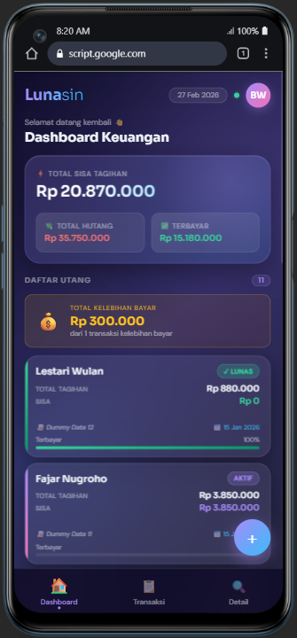
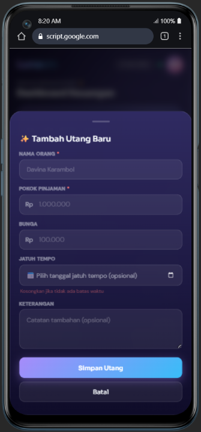
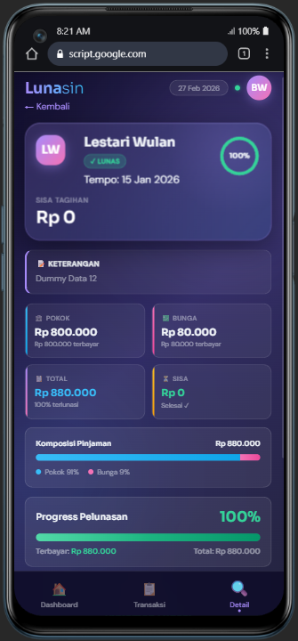
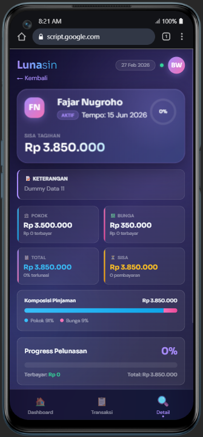
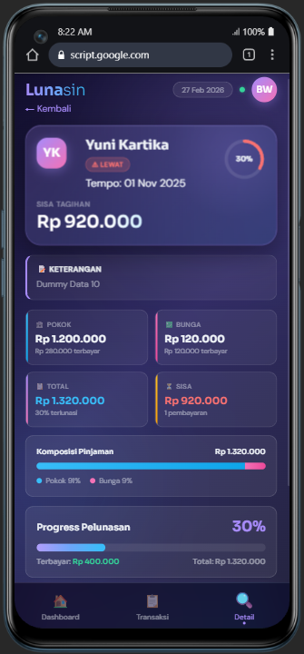
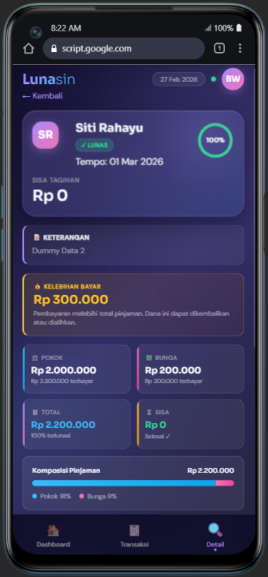
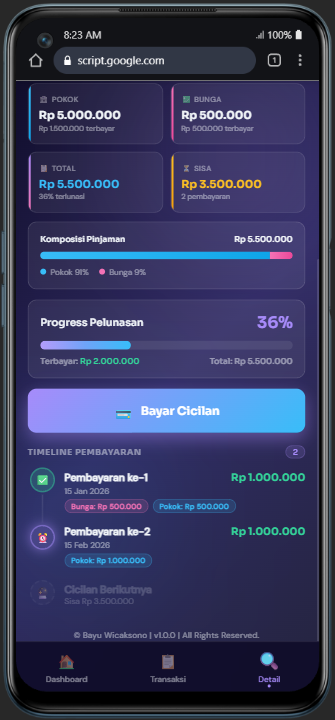
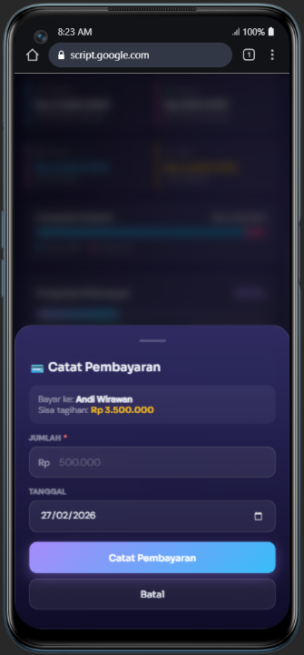
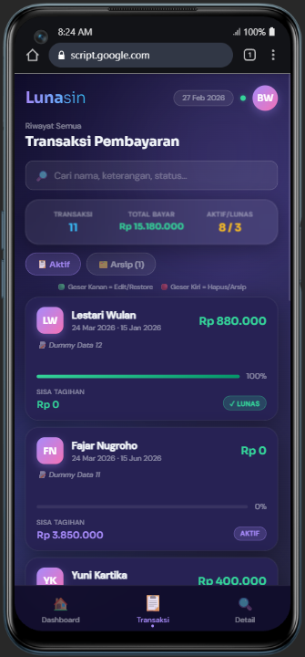
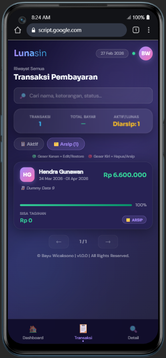

# 🌙 Lunasin

> **Aplikasi manajemen utang pribadi berbasis Google Apps Script + Google Sheets**

Lunasin adalah aplikasi web mobile-first untuk mencatat, memantau, dan mengelola utang piutang secara personal. Dibangun di atas Google Apps Script dengan Google Sheets sebagai database, sehingga **gratis, tanpa server, dan data tersimpan langsung di Google Drive Anda**.


---

## 📸 Preview

### 📱 Application

   
   
   
   
   

---

## ✨ Fitur Utama

| Fitur | Keterangan |
|---|---|
| 📊 **Dashboard** | Ringkasan total hutang, terbayar, dan sisa tagihan secara real-time |
| ➕ **Tambah Utang** | Catat pokok pinjaman, bunga, jatuh tempo, dan keterangan |
| 💳 **Catat Pembayaran** | Rekam cicilan dengan alokasi otomatis bunga vs. pokok |
| ⚠️ **Denda Keterlambatan** | Tambah denda pada tagihan overdue — menambah total tagihan secara langsung, opsional |
| 💰 **Deteksi Lebih Bayar** | Otomatis mendeteksi & menampilkan nominal kelebihan bayar |
| 📋 **Riwayat Transaksi** | Daftar lengkap semua utang dengan search dan pagination |
| 🗂️ **Arsip** | Simpan transaksi lunas ke arsip tanpa menghapus riwayat |
| 🔍 **Pencarian** | Filter berdasarkan nama, keterangan, status (`aktif`, `lunas`, `lebih bayar`) |
| 📈 **Detail & Timeline** | Grafik progress, kartu Pokok/Bunga/Total/Sisa/Denda, dan timeline pembayaran per-utang |
| ↔️ **Swipe Gesture** | Geser kartu kanan/kiri untuk edit, hapus, atau arsip (mobile) |
| 🔄 **Pull-to-Refresh** | Tarik ke bawah untuk memperbarui data dari spreadsheet |
| 📱 **Full-Screen Mobile** | Dioptimasi untuk Android & iPhone, semua ukuran layar |
| 🔗 **Copy Link Utang** | Salin link read-only per-utang untuk dibagikan ke pihak lain |
| ↩️ **Undo Delete** | 5 detik jendela undo setelah menghapus — tidak ada penghapusan tidak sengaja |
| 📝 **Catatan per Cicilan** | Tambahkan catatan opsional pada setiap pembayaran cicilan |
| 🔴 **Badge Overdue** | Ikon Dashboard menampilkan jumlah utang lewat jatuh tempo secara real-time |
| 📳 **Haptic Feedback** | Getaran kontekstual untuk navigasi, hapus, dan validasi (Android) |

---

## 🛠️ Teknologi

- **Backend**: [Google Apps Script](https://script.google.com) (V8 runtime)
- **Database**: Google Sheets (2 sheet: `debts` + `installments`)
- **Frontend**: Vanilla HTML/CSS/JS — tidak ada framework, tidak ada dependency eksternal
- **Font**: [Sora](https://fonts.google.com/specimen/Sora) + [DM Sans](https://fonts.google.com/specimen/DM+Sans) via Google Fonts
- **Cache**: Apps Script CacheService (TTL 300 detik)
- **ID**: Format `DEBT-YYYYMMDD-XXXX` / `INST-YYYYMMDD-XXXX`

---

## 📁 Struktur File

```
lunasin/
├── Code.gs          # Backend — API handler, CRUD, validasi, rate limiting
├── Index.html       # Entry point — HTML struktur + font preload + GAS includes
├── Styles.html      # Semua CSS — design tokens, komponen, animasi
├── Script.html      # Semua JS — state, UI, event handler, demo mode
└── ShareView.html   # Halaman read-only untuk share link per-utang
```

---

## 🚀 Cara Deploy

### Prasyarat
- Akun Google
- Google Spreadsheet (baru atau yang sudah ada)

### Langkah-langkah

**1. Buka Google Spreadsheet**

Buka atau buat spreadsheet baru di [sheets.google.com](https://sheets.google.com).

**2. Buka Apps Script Editor**

Klik menu **Extensions → Apps Script**.

**3. Salin kode**

Di panel kiri editor, buat **5 file** berikut:

| File | Cara membuat | Isi dengan |
|---|---|---|
| `Code.gs` | Sudah ada secara default | Isi file `Code.gs` dari repo ini |
| `Index.html` | Klik `+` → pilih **HTML** → beri nama `Index` | Isi file `Index.html` |
| `Styles.html` | Klik `+` → pilih **HTML** → beri nama `Styles` | Isi file `Styles.html` |
| `Script.html` | Klik `+` → pilih **HTML** → beri nama `Script` | Isi file `Script.html` |
| `ShareView.html` | Klik `+` → pilih **HTML** → beri nama `ShareView` | Isi file `ShareView.html` |

> ⚠️ Nama file harus **sama persis** (case-sensitive). `Code.gs` memanggil `ShareView` dan `Index` memanggil `Styles` dan `Script` via `include()` — salah nama menyebabkan error deploy.

**4. Inisialisasi database**

Jalankan fungsi `initApp()` untuk membuat sheet otomatis:

1. Pilih fungsi `initApp` dari dropdown di toolbar
2. Klik **Run ▶**
3. Izinkan akses Google Sheets saat diminta (popup OAuth)
4. Pastikan log menampilkan `=== initApp OK ===`

> Langkah ini membuat sheet `debts` dan `installments` beserta header kolom secara otomatis.

**5. Deploy sebagai Web App**

1. Klik **Deploy → New deployment**
2. Pilih tipe: **Web app**
3. Isi konfigurasi:
   - **Description**: `Lunasin vX.X.X` *(sesuaikan versinya)*
   - **Execute as**: `Me`
   - **Who has access**: `Only myself` *(atau sesuaikan)*
4. Klik **Deploy**
5. Salin URL Web App yang muncul

**6. Buka aplikasi**

Akses URL Web App di browser HP Anda. Untuk pengalaman terbaik, tambahkan ke Home Screen:
- **Android**: Menu browser → *Add to Home Screen*
- **iPhone**: Share → *Add to Home Screen*

---

## 🗄️ Struktur Database

### Sheet: `debts`

| Kolom | Tipe | Keterangan |
|---|---|---|
| `id` | String | ID unik `DEBT-YYYYMMDD-XXXX` |
| `person_name` | String | Nama peminjam |
| `principal_amount` | Number | Pokok pinjaman (Rupiah) |
| `interest_amount` | Number | Bunga (Rupiah) |
| `total_amount` | Number | Total = pokok + bunga + denda |
| `paid_amount` | Number | Total terbayar |
| `remaining_amount` | Number | Sisa tagihan |
| `status` | String | `active` / `paid` |
| `due_date` | String | Jatuh tempo `YYYY-MM-DD` (opsional) |
| `created_at` | String | Timestamp ISO 8601 |
| `notes` | String | Keterangan (opsional) |
| `updated_at` | String | Timestamp terakhir diperbarui |
| `overpayment_amount` | Number | Kelebihan bayar (jika ada) |
| `archived` | Boolean | `true` jika diarsip |
| `penalty_total` | Number | Akumulasi denda keterlambatan (jika ada) |

### Sheet: `installments`

| Kolom | Tipe | Keterangan |
|---|---|---|
| `id` | String | ID unik `INST-YYYYMMDD-XXXX` |
| `debt_id` | String | Referensi ke `debts.id` |
| `payment_amount` | Number | Jumlah pembayaran |
| `payment_date` | String | Tanggal pembayaran `YYYY-MM-DD` |
| `created_at` | String | Timestamp ISO 8601 |
| `notes` | String | Catatan pembayaran (opsional) |

---

## 🔌 API Reference

Semua request dikirim via `google.script.run.processRequest(jsonString)`.

### `getDebts`

```json
{ "action": "getDebts", "page": 1, "limit": 100 }
{ "action": "getDebts", "id": "DEBT-20250101-0001" }
{ "action": "getDebts", "onlyArchived": true }
{ "action": "getDebts", "includeArchived": true, "q": "budi" }
```

### `createDebt`

```json
{
  "action": "createDebt",
  "person_name": "Budi Santoso",
  "principal_amount": 5000000,
  "interest_amount": 500000,
  "due_date": "2025-12-01",
  "notes": "Pinjaman modal usaha"
}
```

### `updateDebt`

```json
{
  "action": "updateDebt",
  "id": "DEBT-20250101-0001",
  "person_name": "Budi Santoso",
  "principal_amount": 6000000,
  "interest_amount": 600000
}
```

### `addPayment`

```json
{
  "action": "addPayment",
  "debt_id": "DEBT-20250101-0001",
  "payment_amount": 1000000,
  "payment_date": "2025-03-15",
  "notes": "Transfer BCA"
}
```

### `addPenalty`

> Denda bersifat opsional dan hanya tersedia pada tagihan yang berstatus **overdue** (lewat jatuh tempo). Denda diakumulasi di kolom `penalty_total` dan langsung menambah `total_amount`.

### `deleteDebt` / `archiveDebt` / `unarchiveDebt`

```json
{ "action": "deleteDebt",    "id": "DEBT-20250101-0001" }
{ "action": "archiveDebt",   "id": "DEBT-20250101-0001" }
{ "action": "unarchiveDebt", "id": "DEBT-20250101-0001" }
```

### `healthCheck` / `getAppUrl`

```json
{ "action": "healthCheck" }
{ "action": "getAppUrl" }
```

---

## 📱 Kompatibilitas

| Platform | Status |
|---|---|
| Android | ✅ |
| iPhone/iPad | ✅ |
| Desktop | ✅ |

---

## ⚙️ Konfigurasi

Konstanta di `Code.gs` yang bisa disesuaikan:

```javascript
var CACHE_TTL      = 300;  // Cache TTL dalam detik (default: 5 menit)
var LOCK_MS        = 6000; // Lock timeout untuk write operations (ms)
var RATE_LIMIT_MAX = 30;   // Maks request per user per window
var RATE_LIMIT_WIN = 60;   // Rolling window rate limit (detik)
var SHEET_DEBTS    = 'debts';         // Nama sheet utang
var SHEET_INST     = 'installments';  // Nama sheet cicilan
```

---

## 🔒 Keamanan

- Semua input di-sanitasi di backend (`sStr`, `sName`, `sNotes`) dan frontend sebelum dikirim ke Sheets
- Script tag dan atribut event handler di-strip dari semua input
- Lock service digunakan untuk mencegah race condition pada write operations
- Cache di-invalidate setiap kali ada perubahan data
- Rate limiting per user (30 req/menit) mencegah abuse pada URL publik

---

## 🧪 Mode Demo

Saat diakses di luar Google Apps Script (misal: langsung buka `Index.html` di browser), aplikasi otomatis masuk **mode demo** dengan data contoh 12 utang termasuk simulasi denda. Tidak ada perubahan yang tersimpan ke spreadsheet.

---

## 👤 Author

**Bayu Wicaksono**

---

## 📄 Lisensi

MIT License — bebas digunakan, dimodifikasi, dan didistribusikan dengan mencantumkan kredit.